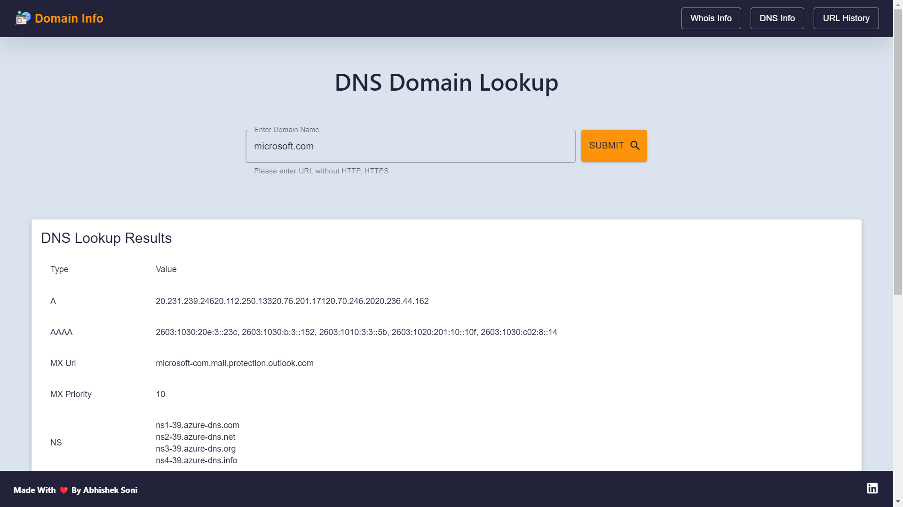

# Domain Info

Domain Info is a Web Application to get the WHOIS and DNS details of a domain.

## Screenshots

#### Whois Lookup

#### DNS Lookup

#### URL History

## Live Application URL

You can access the application live at [https://domain-info-abhishek.netlify.app](https://domain-info-abhishek.netlify.app)

## Prerequisites

- Node.js installed on local machine.

## Features

- Perform Whois lookup on a domain name.
- Perform DNS lookup on a domain name.
- Displays the information in an easy-to-read format.
- Feature to copy data to clipboard via single click.
- User can see the Explored URLs history.

## Installation

1. Clone the repository: `git clone https://github.com/abhi-soni/domain-info.git`

2. Change directory: `cd domain-info`
3. Install dependencies: `npm install`
4. Start the server: `npm start`
5. Open `http://localhost:3000` in your browser to view the app.

## Usage

- Select Whois or DNS tab from the navigation bar.
- Enter a valid domain name in the search bar.
- Click on the "Submit" button to fetch the information.
- The information will be displayed on the screen.
- User can click on the "Copy" Icon to copy the information to clipboard.
- Access the "History" tab to see the Explored URLs history.

## Contributing

Contributions are welcome. Feel free to open a pull request or branch from this repo.
